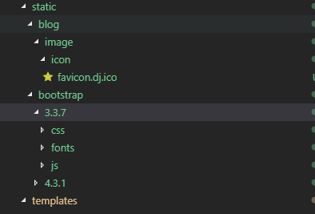

## `blog`应用的开发

### 编写视图

> 编辑视图文件：`blog/views.py`
```
from django.http import HttpResponse

def index(request):
    return HttpResponse("Hello, world. You're at the blog app's index.")
```

### 路由配置

> 1.创建`blog`应用的路由配置文件：`urls.py`到`blog`目录下

> 2.编辑`blog/urls.py`
```
from django.urls import path

from . import views

urlpatterns = [
    path('', views.index, name='index'),
]
```
> 3.编辑`AlpsSnow`项目的路由配置文件：`AlpsSnow/urls.py`
```
# 将`AlpsSnow`项目到`blog`应用的路由加入到`urlpatterns`列表中
from django.contrib import admin
from django.urls import include, path

urlpatterns = [
    path('polls/', include('polls.urls')),
    path('admin/', admin.site.urls),
]
```
>> 函数 include() 允许引用其它 urls。每当 Django 遇到 include() 时，它会截断与此项匹配的 URL 的部分，并将剩余的字符串发送到 urls 以供进一步处理。
注意：当包括其它 URL 模式时你应该总是使用 include() ， admin.site.urls 是唯一例外。

>> 函数 path() 具有四个参数，两个必须参数：route 和 view，两个可选参数：kwargs 和 name。现在，是时候来研究这些参数的含义了。
>>> route:
route 是一个匹配 URL 的准则（类似正则表达式）。当 Django 响应一个请求时，它会从 urlpatterns 的第一项开始，按顺序依次匹配列表中的项，直到找到匹配的项。这些准则不会匹配 GET 和 POST 参数或域名。
>>> view:
当 Django 找到了一个匹配的准则，就会调用这个特定的视图函数，并传入一个 HttpRequest 对象作为第一个参数，被“捕获”的参数以关键字参数的形式传入。
>>> kwargs:
任意的关键字参数可以作为一个字典传递给目标视图函数。
>>> name:
为你的 URL 取名能使你在 Django 的任意地方唯一地引用它，尤其是在模板中。这个有用的特性允许你只改一个文件就能全局地修改某个 URL 模式。
一般在模板中，用来进行页面间的跳转, 如,回到主页

> 4.重新启动开发服务器，访问`http://127.0.0.1:8000/blog/`检验`blog`是否正常。
```manage.py runserver```


### 数据库配置

#### `AlpsSnow/settings.py`
> 1.`django`使用`SQLite`作为默认数据库，默认数据库文件：`db.sqlite3`。如果你想使用其他数据库，请设置`DATABASES`。参照[数据库配置](https://docs.djangoproject.com/zh-hans/2.2/intro/tutorial02/)

> 2.设置 `TIME_ZONE` 为你自己时区。
```IME_ZONE = 'Asia/Shanghai'```

> 3. `INSTALLED_APPS` 默认包括了以下 `Django` 的自带应用。
开启某些应用需要至少一个数据表，所以在使用他们之前需要在数据库中创建数据表。
创建数据表，执行以下命令:
```manage.py migrate```

> 这个 `migrate` 命令检查 `INSTALLED_APPS` 设置，为其中的每个应用创建需要的数据表，至于具体会创建什么，这取决于你的 `AlpsSnow/settings.py` 设置文件和每个应用的数据库迁移文件（我们稍后会介绍这个）。这个命令所执行的每个迁移操作都会在终端中显示出来。如果你感兴趣的话，运行你数据库的命令行工具，并输入 `\dt (PostgreSQL)`， `SHOW TABLES; (MySQL)`， `.schema (SQLite)`或者 `SELECT TABLE_NAME FROM USER_TABLES; (Oracle)` 来看看 `Django` 到底创建了哪些表

### 创建模型

#### 创建模型
> 在`Django`里面写一个交互式`web`应用程序的第一步就是定义模型，也就是数据库结构设计和附加的其他元数据。
>> 详细代码参照`blog/models.py`。
代码非常直白，每个模型被表示为 `django.db.models.Model` 类的子类。每个模型有一些类变量，它们都表示模型里的一个数据库字段。

#### 创建模型
> 上面的一小段用于创建模型的代码给了 `Django` 很多信息，通过这些信息，`Django` 可以：
>> 1.为这个应用创建数据库 `schema`（生成 `CREATE TABLE` 语句）。
>> 2.创建可以与 `Category`, `Tag` 和 `Post` 对象进行交互的 `Python` 数据库 API。

> 1.把`blog`应用包含到我们的项目里，即，我们需要把`blog`应用的配置类`BlogConfig`加入到` INSTALLED_APPS `中。
```
INSTALLED_APPS = [
    'django.contrib.admin',
    'django.contrib.auth',
    'django.contrib.contenttypes',
    'django.contrib.sessions',
    'django.contrib.messages',
    'django.contrib.staticfiles',
    'blog.apps.BlogConfig',         #因为 BlogConfig 类写在文件 blog/apps.py 中，所以它的点式路径是 'blog.apps.PollsConfig
]
```

> 2.运行以下的命令，`Django` 会检测你对模型文件的修改，并且把修改的部分储存为一次 迁移。
```
manage.py makemigrations
```

> 3.运行以下的命令，选中所有还没有执行过的迁移（Django 通过在数据库中创建一个特殊的表 django_migrations 来跟踪执行过哪些迁移）并应用在数据库上 - 也就是将你对模型的更改同步到数据库结构上。
```
manage.py migrate
```

#### 总结一下，改变数据模型的三个步骤
> 1.编辑 `models.py` 文件，改变模型。
> 2.运行 `python manage.py makemigrations` 为模型的改变生成迁移文件。
> 3.运行 `python manage.py migrate` 来应用数据库迁移。

### `Django`后台管理页面

#### 创建一个管理员账号

> 1.执行以下命令创建管理员账号：

```
manage.py createsuperuser
Username (leave blank to use 'xxxxx'):
Email address: xxxxx@qq.com
Password:
Password (again):
Superuser created successfully.
```

> 2.启动开发服务器:
```manage.py runserver```

> 3.访问`http://127.0.0.1:8000/admin`进入后台管理系统

#### 向后台管理页面加入`blog`应用
> 只需要做一件事：我们得告诉管理页面，博客 `Category` `Tag` `Post` 对象需要被管理。打开 blog/admin.py 文件，把它编辑成下面这样：

```
from django.contrib import admin
from .models import Category, Tag, Post
admin.site.register(Category)
admin.site.register(Tag)
admin.site.register(Post)
```
> 刷新后台管理页面后可以看到`Category` `Tag` `Post` 对象。


如果`sqlite`数据库报告`no such table: xxxx`的错误，使用如下方法解决：
> 1.先把应用下的 `migrations` 文件夹下的除了 `__init__.py` 的文件全部删完
> 2.删除最外侧的 db.sqlite3 文件（数据可以先保存一下）
> 3.执行下面的命令
```
python manage.py makemigrations
python manage.py migrate
```

### `blog`应用的视图`view`和模板`Template`
> 1.在`blog/views.py`中创建视图函数。
```
from django.shortcuts import render
from .models import Post

# Create your views here.
def index(request):
    postlist = Post.objects.all()
    return render(request, 'blog/index.html', locals())

```
> 2.在`AlpsSnow/settings.py`中设置模板文件夹的位置。默认情况下不需要做修改，直接在`blog`应用的目录下创建`templates/blog`。换句话说你的`index.html`文件应该是` blog/templates/blog/index.html `
你项目的 `TEMPLATES` 配置项描述了 `Django` 如何载入和渲染模板。默认的设置文件设置了 `DjangoTemplates` 后端，并将` APP_DIRS` 设置成了 True。这一选项将会让 `DjangoTemplates` 在每个 `INSTALLED_APPS` 文件夹中寻找 `templates` 子目录。这就是为什么尽管我们没有像在第二部分中那样修改 `DIRS` 设置，Django 也能正确找到 `blog` 的模板位置的原因。

> 3.在`blog/urls.py`中创建网址和views.py中函数的对应关系。

> 4.启动开发服务器:
```manage.py runserver```

> 5.访问`http://127.0.0.1:8000/blog`,可以看到从数据库读取的博客数据。


### 引入静态资源文件（js,css,图片等）

#### 引入`bootstrap`
> 1.[下载bootstrap编译后的文件](http://v3.bootcss.com/getting-started/#download)

> 2.配置`AlpsSnow/settings.py`文件
```python
STATIC_URL = '/static/' #此处必须

STATIC_ROOT = os.path.join(BASE_DIR, 'collected_static')#此处必须,部署时候会用到

STATICFILES_DIRS = (
    os.path.join(BASE_DIR, "static"),#此处可选，django开发服务器static加载顺序
)
```
> 3.html文件开始处插入下面的代码
```thml
<!DOCTYPE html>

<html lang="zh">
...
<link rel="stylesheet" href="">
<script src=""></script>
...
```
> 4.静态文件结构如下



参照：[Django静态文件配置](https://blog.csdn.net/xujin0/article/details/83421626)

### 上下文渲染器`context_processors`
有时候我们想让一些内容和数据在多个模板中都要有，比如导航内容，侧边框内容等等，我们又不想每个视图函数都写一次这些变量内容，怎么办呢？这时候就可以用 Django 上下文渲染器来解决。

> 1.在`blog`应用的文件夹下面创建`context_processors.py`
```python
from .models import Tag, Category, Article

"""
blog app上下文渲染器
"""

#导航栏和右边栏的上下文渲染器
def sidebar(request):
    # 所有标签
    tag_list = Tag.objects.all()

    # 所有文章分类
    category_list = Category.objects.all() 

    # 文章阅读量排行榜
    article_ranklist = Article.objects.all().order_by('-view')[0:6]  
    
    return {
        'category_list': category_list,
        'article_rank': article_ranklist,
        'tag_list': tag_list 
    }
```

> 2.在项目的`settings.py`文件的`TEMPLATES`的`context_processors`数组中添加`'blog.context_processors.sidebar',`

> 3.在所有的模板文件中就可以直接使用`sidebar`函数返回的对象。

### MYSQL的使用

### 安装`MYSQL`和创建数据库
> 1. [下载MYSQL](https://dev.mysql.com/downloads/installer/)
> 2. [安装MYSQL](https://www.runoob.com/w3cnote/windows10-mysql-installer.html)
> 3. 使用`MySql Workbench`创建一个`schema` （在 MySQL 中，SCHEMAS 相当于 DATABASES 的列表。）

#### Django项目中使用MYSQL
> 1.安装`mysqlclient`包
```python
pip install mysqlclient
```

> 2.修改`settings.py`的`DATABASES`
```python
DATABASES = {
    'default': {
        #'ENGINE': 'django.db.backends.sqlite3',         #sqlite3的配置
        #'NAME': os.path.join(BASE_DIR, 'db.sqlite3'),   #sqlite3的配置
        'ENGINE': 'django.db.backends.mysql',
        'NAME': 'djangoblog',
        'USER': 'root',
        'PASSWORD': 'xxx',
        'HOST': 'localhost',
        'PORT': '3306',       
    }
}
```

> 3. python manage.py makemigrations

> 4. python manage.py migrate