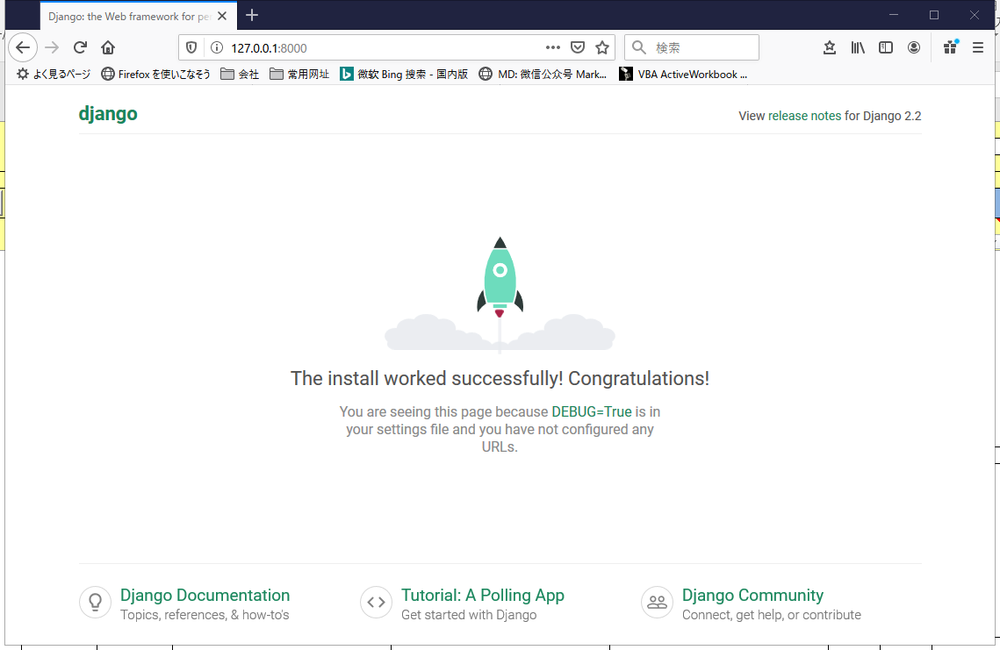

## 创建`Django`项目和应用

### 安装`Django`
 > ```(KnowledgeBoxEnv) D:\python work\Knowledge-Box\Knowledge-Box\django>pip install Django```

#### 去人`Django`的版本信息
> ```(KnowledgeBoxEnv) D:\python work\Knowledge-Box\Knowledge-Box\django\AlpsSnow>python -m django --version```

### 创建`AlpsSnow`项目
 >  ```(KnowledgeBoxEnv) D:\python work\Knowledge-Box\Knowledge-Box\django>django-admin startproject AlpsSnow```

#### 项目`AlpsSnow`的文件结构 
```
(KnowledgeBoxEnv) D:\python work\Knowledge-Box\Knowledge-Box\django>cd AlpsSnow
(KnowledgeBoxEnv) D:\python work\Knowledge-Box\Knowledge-Box\django\AlpsSnow>tree /F
.
│  manage.py
│
└─AlpsSnow
        settings.py
        urls.py
        wsgi.py
        __init__.py
```
#### 启动`AlpsSnow`项目
 ```
 (KnowledgeBoxEnv) D:\python work\Knowledge-Box\Knowledge-Box\django\AlpsSnow>manage.py runserver
Watching for file changes with StatReloader
Performing system checks...

System check identified no issues (0 silenced).

You have 17 unapplied migration(s). Your project may not work properly until you apply the migrations for app(s): admin, auth, contenttypes, sessions.
Run 'python manage.py migrate' to apply them.
October 31, 2019 - 15:26:05
Django version 2.2.6, using settings 'AlpsSnow.settings'
Starting development server at http://127.0.0.1:8000/
Quit the server with CTRL-BREAK.
 ```
#### 访问`http://127.0.0.1:8000/`确认`AlpsSnow`项目是否创建成功


### 在`AlpsSnow`项目下创建`APP`应用

> 项目 VS 应用
>> 项目和应用有啥区别？应用是一个专门做某件事的网络应用程序——比如博客系统，或者公共记录的数据库，或者简单的投票程序。项目则是一个网站使用的配置和应用的集合。项目可以包含很多个应用。应用可以被很多个项目使用。

#### 创建`blog`应用
> 在`manage.py`的同级目录下执行: ```manage.py startapp blog```

#### `blog`应用的文件结构 
```
.
│  db.sqlite3
│  manage.py
│
├─AlpsSnow
│  │  settings.py
│  │  urls.py
│  │  wsgi.py
│  │  __init__.py
│  │
│  └─__pycache__
│          settings.cpython-37.pyc
│          urls.cpython-37.pyc
│          wsgi.cpython-37.pyc
│          __init__.cpython-37.pyc
│
└─blog
    │  admin.py
    │  apps.py
    │  models.py
    │  tests.py
    │  views.py
    │  __init__.py
    │
    └─migrations
            __init__.py
```
> 之后的工作就是开发各个应用了，总之就是编写`MVT`文件（`view.py`,`models.py`,`Templates`（html文件）），在配置项目路由，应用路由，静态文件(`js`,`css`)，等等，吧啦吧啦...
更详细的开发过程可以看 [blog应用的开发](./AlpsSnow/blog/README.md)

> 参照：[django官方教程](https://docs.djangoproject.com/zh-hans/2.2/intro/)


### 局域网中访问`django`项目
> 1.项目启动的时候设置设置`host ip`
```manage.py runserver 0.0.0.0:8000```

> 2.项目的`settings.py`的 `ALLOWED_HOSTS` 中设置自己的`ip`，表示允许别人访问时该指定的`host`名
```ALLOWED_HOSTS = ['192.168.1.3']```
